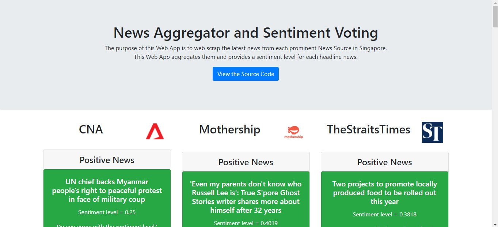
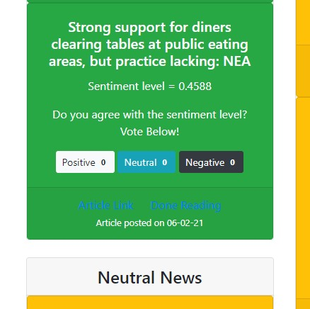

# News-Aggregator-and-Sentiment-Voting

Application is deployed and live on this link: https://demo.lioneltsy.life/

Just a simple weekend project.
Purpose of this application is to web scrap the top headline news of different news sources, get a basic sentiment level from the headlines and allow users to vote their opinion on the true sentiment of the news.

## How it works
This app uses React as a front end and flask as a backend. It is deployed onto AWS ec2 with Docker. The backend is served on a Docker image with python and the required libraries installed using pip. The frontend is deployed together with nginx in another Docker container. Nginx is used to route http/https request and to handle queries between frontend and the flask backend. A Cronjob is running on the Ubuntu EC2 itself to update the sqlite database daily with the latest headlines from the various news sources.

In addition to just displaying the scrapped headlines, the backend has been programmed to handle voting. Frontend has been coded to disable buttons after voting.

## Extensions
- With feedback from Users, we can create a database to train a machine learning model that identifies sentiment lvel of headlines. So far I could only find such data for financial news.
- Identify the same news event from different sources and group them together to allow users to identify how different news sources report the same event differently
- Add a machine learning model to classify type of news.
